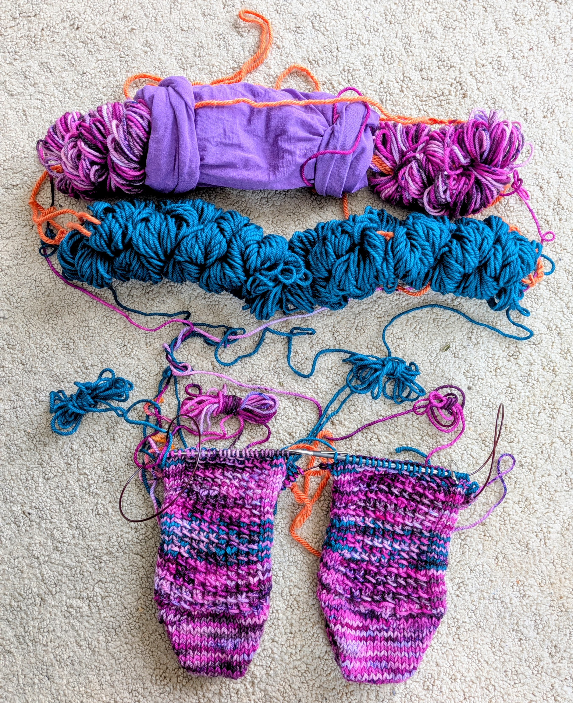

# Snake Knitting: How to knit 2-socks-at-a-time 2-colors-at-a-time from Figure-8-balls

Here my unorthodox way of knitting socks -- I hope this is useful to someone out there in the universe. 

I mostly knit socks, or other sock-like items like finger-less gloves or hats.  All of these items follow the 
"2 (socks) at a time, toe up" recipe. I am not going to recount that here.

I pretty much only knit with yarn from Rose Hill Yarns, and they exclusively deliver yarn as a skein. 
Now I am too cheap to buy a ball winder. I started windung all my "balls" with a finger-8, which you can theoretically wind on one hand (index+middle finger one loop, ring+pinky for the other loop), just take some scrap yarn to keep each hunk from unraveling.
Now this is not really practical for full skeins, so my partner built me a little "loom" (for lack of a better word) with two very long fingers.

The result are these long "Figure-8 snakes" you see in the picture. The nice side effect is that you can pull the yarn from either end without getting a tangled mess. 

In my 2-sock knitting I use one end for sock A, and the other end for sock B. 
This way I don't have to commit where to snip the yarn into two balls (get it wrong and have to resplice the yarn, etc).

Now I do love to knit with varied yarns and two colors. You can in principle apply the same idea. Use one end from each snake for sock A, and the other end from each snake for sock B.

Here is where things inevitably get messy, because one color tends to wrap around the other color as you knit your sock rows. 
(Also when you carry your knitting to your knit-mee-ups your snakes might get entangled).

See below the picture for some strategies.

## Strategy 1: Old Panty Hose Sleeves

> Collect old panty hoses, snip off the legs. Stuff your snake-ball into the leg, pull yarn from either leg hole.

This also helps to keep your crochet hook from pulling loops out of your Figure-8 snake

## Stategy 2: Force Snakes to Stay Side-by-side 

> Tie both snakes together so they are kept side-by-side. 

This avoids that they rotate around one another in your kntting bag and create a mess.  It also allows you to label which snake ends belong to sock A.

## Strategy 3: Collect Mini-Figure-8's and keep Inside Socks

In 2-socks-at-a-time, when you knit with two colors, the easiest way to avoid entangled balls is to keep the balls inside your socks. Sadly, that does not work with this setup because both socks pull from the same ball.

> Instead, occasionally pull "plenty of yarn" through the entangled mess, then rewind it as a Figure 8 hunk.  I keep that hunk inside each sock.

This avoids making the mess even messier and gives you some tangle-free knitting for a number of rows.

## Strategy 4: Detach Small Hunks of the Figure-8 Snake

If you are better at planning ahead, instead of pulling, and rewinding (as in Strategy 3) you can directly do this:

> Detatch some hunks of your big snake by cutting the contrast yarn that keeps the snake together, then directly stuff the smaller hunk inside each sock.

Just be careful to not cut the yarn you will be knitting with.

## Strategy 5: Feed the Yarn though the Toes

> After knitting the toes, you can feed the yarn ends through a dedicated hole on the sock. So while the big snake is on the outside,
your working yarn will come through the hole towards the inside of your sock, there you can pull it out without any tangled mess. 

When you turn your work, just make sure that the snake between the toes get turned along with your work. Think: the snake has now become part of your work, but it will be consumed as your socks grow.

To avoid rubbing and stretching the hole in your sock, I recommend to take a short tube through which the end will run.
